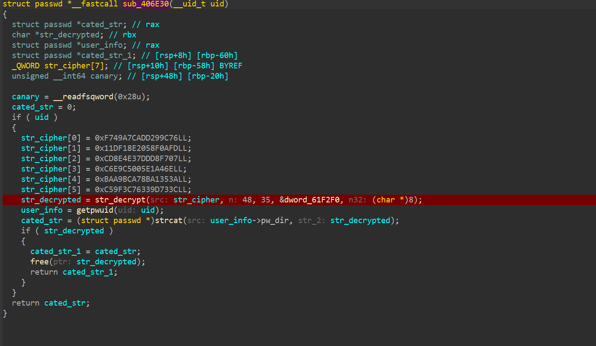

# unicall

**Function-level Unicorn emulation for PE and ELF binaries — call any function with a single statement.**

`unicall` maps a binary into the Unicorn engine, redirects external symbols (GOT/IAT) to Python-implementable trampolines, and exposes a unified `call()` API for invoking arbitrary functions at arbitrary addresses. It is designed for malware analysis tasks such as string decryption, algorithm extraction, and deobfuscation, where the analyst wants to reuse the binary's own code instead of reimplementing its (possibly customized) cryptography in Python.

## 特性

- **双格式统一 API**：`Emu()` 按文件魔数自动识别 ELF / PE（x86/x64），加载、环境搭建、hook 一次完成，调用任意函数只需一行 `call()`。
- **类型驱动的参数语义**：`int` 按值传递（若该值是镜像内地址则自然成为指针，与 IDA 显示的地址一致）；`bytes` / `str` 自动放入模拟内存并传递指针；无需手工构造缓冲区。
- **调用约定内置**：SysV x64、Win x64（含 shadow space 与栈上第 5 个及之后的参数）、cdecl x86；栈对齐自动处理。
- **GOT/IAT 蹦床重定向**：外部符号槽位统一改写指向分发页，任意深度的 PLT thunk 均可拦截；hook 支持延迟注册。
- **严格模式**：未注册 hook 的外部符号被调用时抛出异常并提示符号名，避免静默错误产出不可信的结果（可选关闭）。
- **最小运行环境**：栈、bump 堆（支持 realloc 语义）、scratch 缓冲区、TLS 栈 canary（ELF `fs:0x28`）或 TEB/PEB（PE），以及 14 个以上常用 libc/CR shim。
- **确定性异常通道**：hook 内异常通过 `RIP=RET_MAGIC` 安全终止模拟后在 Python 侧重现，不依赖 Unicorn 对 hook 异常的传播行为。
- **调试工具**：`enable_trace()` 逐指令反汇编输出，用于定位模拟偏离的位置。

## 安装

```bash
# 使用 uv（推荐）
uv sync --extra dev

# 从 PyPI 安装
pip install unicall-emu

# 或本地开发安装
pip install -e .
```

依赖：`unicorn >= 2.0.1`、`capstone >= 5.0`、`pyelftools >= 0.29`（PE 加载器不依赖 pyelftools）。

## 快速上手

```python
from unicall import Emu

emu = Emu("sample.bin")

# 注册外部符号
emu.hook_import("malloc", lambda e, n: e.malloc(n))

# 调用任意地址的函数
out = emu.call(0x402B80, [blob, 48, 35, key, 8], ret="str")
```

PE 样本同理，hook 名使用 `"kernel32.dll!CreateFileW"` 形式，默认调用约定为 Win x64：

```python
emu = Emu("malware.exe")
emu.hook_import("fake.dll!magic_number", lambda e: 0x1337)
ret = emu.call(0x401010, [b"data", 0x10], convention="win", ret="str")
```

### 参数语义

| Python 类型 | 传递方式 | 说明 |
|---|---|---|
| `int` | 按值放入寄存器 | 若该值是镜像内地址，即等价于指针（镜像按原始地址映射） |
| `bytes` / `bytearray` | 写入 scratch 内存，传指针 | 数据以常量形式出现时最直接 |
| `str` | UTF-8 编码并补 `\0` 后同上 | C 字符串 |

## 实战案例：RotaJakiro 字符串解密

RotaJakiro 是一个 Linux 后门家族，其字符串使用 AES-256 加密并在解密后对每个字节做循环移位（`str_decrypt` @ `0x402B80`）。分析时常见的需求是把全部 60 个调用点的密文批量解出。使用 unicall 时，加密算法本身由二进制原生执行，分析者只需提供每个调用点的参数：

```python
import struct
from unicall import Emu

emu = Emu("RotaJakiro.malware")

blob = raw[0x4187E0 - 0x400000 : 0x4187E0 - 0x400000 + 0xE0]
print(emu.call(0x402B80, [blob, 0xE0, 0xDE, 0x61F300, 8], ret="str"))
# "#system-daemon - configure for system daemon ... exec %s respawn"

blob2 = struct.pack("<6Q", 0xF749A7CADD299C76, 0x11DF18E2058F0AFD,
                    0xCD8E4E37DDD8F707, 0x0C6E9C5005E1A46E,
                    0xBAA9BCA78BA1353A, 0xC59F3C76339D733C)
print(emu.call(0x402B80, [blob2, 48, 35, 0x61F2F0, 8], ret="str"))
# ".dbus/sessions/session-dbus"
```



完整示例见 [examples/rotajakiro_str_decrypt.py](examples/rotajakiro_str_decrypt.py)。

## 与现有方案的比较

| | unicall | [flare-emu](https://github.com/mandiant/flare-emu) | [Qiling](https://github.com/qilingframework/qiling) | [Speakeasy](https://github.com/mandiant/speakeasy) |
|---|---|---|---|---|
| 定位 | 单函数调用，轻量独立库 | IDA/Rizin 插件，脚本式单函数模拟 | 完整用户态模拟（rootfs/syscall） | Windows 恶意软件运行时建模 |
| 依赖 | 无（纯 Python + Unicorn） | 需 IDA/Rizin + 其 Python API | rootfs、较重 | 内置 WinAPI 模型 |
| 格式 | ELF + PE，x86/x64 | 跟随 IDA 支持的格式（含 ARM 系） | ELF/PE/Mach-O 等，多架构 | PE/shellcode |
| 批量工作流 | 内置（调用点骨架 + JSON 批量） | `iterate` API | 自行搭建 | 自行搭建 |
| 可嵌入 CI/管道 | 直接可用 | 需 IDA 授权环境 | 可以，配置较重 | 可以 |

定位差异：需要 ARM 支持或希望在 IDA 内交互式模拟时，flare-emu 是成熟的现成方案；需要跨平台完整运行环境时选择 Qiling。unicall 的价值在于独立于任何逆向工具、单文件可读、可直接进入自动化管道，且针对“大量解密调用点”这类批量场景提供了一等公民的工作流。

## 性能

实测环境：Windows 11，Python 3.12，Unicorn 2.1.4（详见 [bench/bench_speed.py](bench/bench_speed.py)）：

| 项目 | 耗时 |
|---|---|
| `Emu()` 冷启动（RotaJakiro，2.2MB 镜像映射 + hook 安装） | ~3.3 ms |
| `call()` 框架开销下限（PE add4，纯寄存器运算） | ~9 us |
| 单次 `str_decrypt`（AES-256，3 个块，含逐字节旋转） | ~0.5 ms |
| 批量解密全部 60 个调用点 | ~31 ms |

一个值得注意的实现细节：向 `emu_start` 传入非零 `timeout` 会使 Windows 上每次调用固定增加约 15 ms（QEMU 定时器受系统定时器分辨率限制）。因此 `call()` 默认不启用墙钟超时，以 `max_instr` 指令数上限作为失控保护；`timeout` 参数保留给确实需要墙钟限制的长任务。

## 应用场景

- 恶意软件字符串解密与配置提取（本项目的直接来源）
- 提取二进制内的加密、hash、校验算法并在 Python 侧调用
- 反混淆：执行解混淆例程还原控制流或数据
- CTF：快速调用题目二进制中的关键函数
- 安全自动化：作为管道组件批量处理样本（无逆向工具依赖）
- 坐标解密：懂的都懂

## API 速查

```python
emu = Emu(path, base=None, arch=UC_MODE_64, strict_imports=True)
emu.call(addr, args, convention=None, ret="int", max_instr=200_000_000)
emu.hook_import(name, fn)          # 外部符号 hook（fn 首参为 emu）
emu.hook_skip(addr, fn)            # 按地址截获内部函数（fn 或常量）
emu.malloc(n, zero=False)          # 模拟堆分配，返回指针
emu.read_mem / write_mem / read_cstring
emu.enable_trace(limit=500)        # 逐指令调试输出
StopEmulation                      # shim/hook 内抛出以干净终止当前 call()
```

## 项目结构

```
src/unicall/
  __init__.py     # Emu 工厂（魔数自动识别）与公共导出
  _core.py        # 环境搭建、蹦床分发、调用约定、call()、trace
  _elf.py         # ELF 加载器（PT_LOAD、GOT/重定位、PIE）
  _pe.py          # PE 加载器（节映射、.reloc、import directory）
  shims.py        # 内置 libc / WinAPI shim
tests/            # pytest：PE 全链路（自构造样本）+ ELF 全链路（真实样本）
bench/            # 性能基准
examples/         # RotaJakiro 实战示例
```

## 测试

```bash
uv run pytest -q          # 8 项测试；ELF 用例需要样本，缺失时自动跳过
uv run python bench/bench_speed.py
```

# 应用

我基于这个项目实现了一个 IDA 的插件 [ida-unicall](https://github.com/halfcity789/ida-unicall)，允许在 IDA 内实现便捷的模拟执行。

## Roadmap

- ARM / ARM64 支持（Unicorn 本身已具备，需补加载器与调用约定）
- PE delay-load import 支持

## License

MIT
